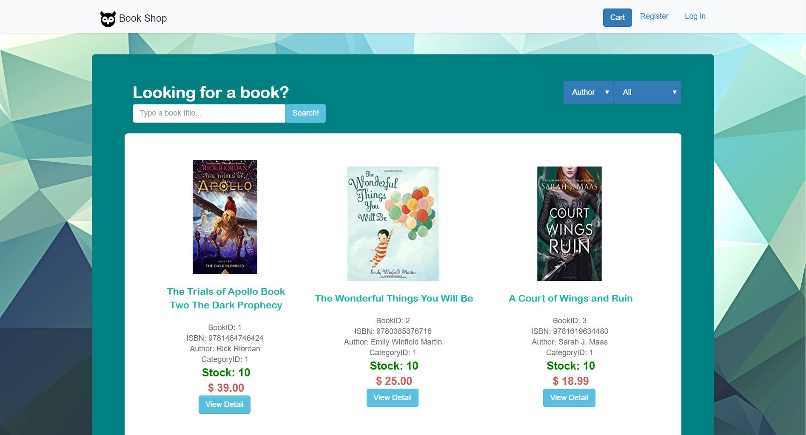

# Online-Bookstore
An ASP.NET web app developed with National University of Singapore, Institute of Systems Science, written in C# using Visual Studio. 
Functionalities include login, shopping cart, searching, adding and updating books, file upload (book image), and identity authentication.

## Screenshots

## Contributors
- **Geraldine:** Adding of new book to inventory (with validation and file upload features), Home page (CSS)
- **Kyler:** Checkout, Integration
- **Saphira:** Book details, Integration
- **Priyanga & Shalin:** Home page
- **Pengkai:** Checkout
- **Cheng Yuan:** Login
- **Yan Bo:** Site master, Integration
- **Fiona:** Update Inventory

## Running the project
- Import the database Team10BookShop.bak into SSMS 
- Open the .sln file to open the ASP.NET project in Visual Studio. Click run (on development server)
